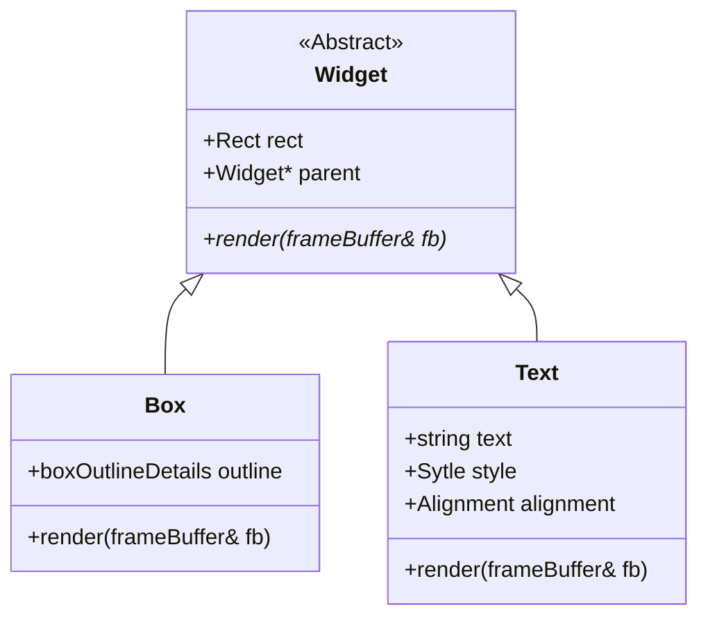

# TUI — Declarative React/JSX-Inspired Terminal UI Framework

[](https://opensource.org/licenses/MIT)
[](https://en.cppreference.com/w/cpp/compiler_support/20)
[](https://cmake.org/)
[]()

**TUI** is a modern, declarative, React/JSX-inspired terminal user interface (TUI) framework built from the ground up using C++20. It splits layout specification from component implementations by compiling JSX-like layout templates into a generic tree of component nodes, facilitating clean separation of concerns and high-performance, double-buffered rendering in the terminal.

---

## 🎯 Goals & Non-Goals

### Goals
* **Declarative Layouts**: Define terminal interfaces via clear, hierarchical JSX-like layout trees.
* **Separation of Concerns**: Keep parser modules agnostic to specific widgets. The parser generates a generic node tree without knowing how a widget executes layout math or renders visually.
* **Dynamic Widget Registration**: Add custom widgets to the runtime environment using a Widget Registry without modifying the parsing engine.
* **Double-Buffered Rendering**: Track screen states to redraw only modified cells, reducing terminal flicker and optimizing performance.
* **Modern C++ Architecture**: Leverage features of C++20 (including modules compatibility, standard library containers, and strong type safety).

### Non-Goals
* Not a web framework or GUI engine (does not compile to Web browsers, X11, Wayland, or desktop native windows).
* Not a general-purpose HTML/XML validator.
* Not an direct abstraction of complex Unix curses libraries (relies on raw ANSI escape sequences for maximum portability and compatibility).

---

## 🏛️ Architecture Overview

```text
       [ JSX layout template ]
                  │
                  ▼
               [ Lexer ]  <─── (Tokenizes layout tags & attributes)
                  │
                  ▼
              [ Parser ]  <─── (Recursive-descent syntactic analyzer)
                  │
                  ▼
          [ AST / Node Tree ]
                  │
                  ▼
         [ Widget Registry ]  <─── (Resolves & instantiates widgets)
                  │
                  ▼
           [ Layout Pass ]    <─── (Computes absolute widget coordinates)
                  │
                  ▼
           [ Render Pass ]    <─── (Recursive DFS rendering of node tree)
                  │
                  ▼
         [ Double Buffer ]    <─── (Diffs previous vs current frame cells)
                  │
                  ▼
          [ Standard Out ]    <─── (ANSI escape outputs to user terminal)
```

1. **Lexer & Parser**: The Lexer scans input layout syntax. The Parser uses a recursive-descent strategy to build a tree of generic `Node` objects containing tag names (e.g. `"Box"`, `"Text"`) and their attributes represented as a key-value attribute collection.
2. **Widget Registry**: Converts generic parsed `Node` targets into runtime subclass representations of `Widget` (such as `Box` or `Text`) via an extensible dynamic lookup table.
3. **Layout Engine**: Traverses the instantiated tree to compute sizing and positional coordinates (`Rect`) based on alignment properties and parent bounds.
4. **Double Buffer Rendering**: A double buffer (`frameBuffer`) keeps track of current and previous frame cells. When rendering, only the diffed differences are flushed to stdout, resulting in highly responsive terminal interactions.

---

## 📐 Widget Hierarchy

The framework provides an abstract `Widget` base class which represents any drawable component in the terminal grid layout:



---

## 🚀 Hello World Example

Below is a simple programmatic example showcasing how to initialize the TUI terminal engine and draw widgets directly to the double buffer:

```cpp
#include "terminal.hpp"
#include "tools.hpp"

int main() {
    // Instantiate terminal window manager
    terminal term;
    
    // Hide terminal cursor for cleaner rendering output
    tools::invisiableCursor();

    for (;;) {
        // Move terminal cursor back to top-left coordinate (0, 0)
        tools::cursorHomePosition();
        
        // Measure current size of standard output terminal
        term.measurements();
        
        // Allocate current and previous frame cell buffers
        term.createScreen();
        
        // Draw layout elements
        // Draw a thick outer border spanning the entire terminal size
        term.drawBox(boxStyle::light, {0, 0, term.row, term.col});
        
        // Draw a heavy accent box container
        term.drawBox(boxStyle::heavy, {1, 1, 10, 25});
        
        // Render simple text inside our accent box
        term.drawText(2, 2, "Hello World");
        
        // Compare double buffers and write modifications to standard output
        term.display();
    }
    return 0;
}
```

---

## ⚙️ Installation & Build Instructions

### Prerequisites
- A modern C++ compiler supporting C++20 (e.g., Clang 16+, GCC 13+).
- **CMake** version 3.28 or later.
- **Ninja** generator (highly recommended for processing C++ modules dependencies cleanly).

### Getting Started

```bash
# Clone the repository
git clone https://github.com/AlterWill/TUI.git
cd TUI

# Clean any existing build artifacts
rm -rf build

# Configure using CMake with the Ninja generator
cmake -G Ninja -B build

# Build the executable
cmake --build build

# Run the program
./build/tui
```

---

## 🗺️ Roadmap

The project is structured in 10 progressive phases of development:

### Phase 1: Core Foundation
- [x] Basic programmatic Widget tree hierarchy setup
- [x] Double-buffered `frameBuffer` configuration
- [x] Character and text draw pipeline (`Text::render`)
- [x] Outlined box drawing system (`Box::render`)
- [ ] Element visual Padding calculation
- [ ] Element Margin boundaries support
- [ ] Styled text properties (bold, italic, underlines)
- [ ] Row flow layout manager
- [ ] Column flow layout manager

### Phase 2: Text System
- [x] Word wrapping paragraph helper functions
- [x] Text alignments (left, right, center alignment)
- [ ] Rich markup parsing logic (colored spans, embedded styles)
- [ ] Paragraph widget container holding block-wrapped text

### Phase 3: Interactive Widgets
- [ ] Button widget with active highlight states
- [ ] Checkbox widget toggle selectors
- [ ] Radio button group selectors
- [ ] Toggle switch widget

### Phase 4: Input
- [ ] Non-blocking terminal keyboard event loops
- [ ] Focus management system (moving cursor selection through inputs)
- [ ] TextInput widget for inline editing
- [ ] PasswordInput widget masking user characters
- [ ] TextArea widget for multi-line textual editors

### Phase 5: Layout
- [ ] Flex layouts (mimicking CSS flexbox styles)
- [ ] Grid layout structures
- [ ] Scrollable window containers

### Phase 6: Data Widgets
- [ ] Dynamic lists (lists of selectable items with scroll tracking)
- [ ] Data tables supporting horizontal columns and alignments
- [ ] Tree view expansion/contraction structures

### Phase 7: Terminal Features
- [ ] Terminal mouse support (click, scroll, select events)
- [x] Wide Unicode character support (UTF-8, UTF-32 conversion)
- [ ] Terminal window resize signal handling
- [x] Standard 16-color ANSI output styling

### Phase 8: Advanced Widgets
- [ ] Multi-tab views
- [ ] Dropdown popup menus
- [ ] Modal dialog boxes
- [ ] Transient popup notifications
- [ ] Loading progress bars

### Phase 9: Rendering Optimizations
- [ ] Dirty rectangle tracking (rendering only bounding boxes that changed)
- [ ] Virtual DOM representation of component state
- [ ] Render tree diffing algorithm

### Phase 10: Ecosystem
- [ ] Styled configuration theme files (JSON or YAML format)
- [ ] Markdown terminal renderer
- [ ] Code syntax highlighting widget
- [ ] Declarative JSON configuration loading
- [ ] C++ Declarative UI DSL

---

## 🔮 Future Ideas
* **Hot Module Reloading (HMR)**: Automatically update layout styles in runtime by editing layout JSX configs without rebuilding binary files.
* **WebAssembly Terminal Target**: Compile using Emscripten to run terminal UI components directly in browser applications.
* **CSS-Style Selectors**: Assign stylesheets externally to configure widget styling rules using target class names or ID tags.

---

## 🤝 Contribution Guidelines

We welcome contributions! Please follow these guidelines:
1. Fork this repository and create your feature branch: `git checkout -b feature/cool-feature`
2. Follow modern C++20 standard conventions and ensure formatting rules compile nicely.
3. Keep code clean and lint-free by using the configuration defined in our [.clangd](.clangd) files.
4. Open a pull request explaining your changes and reference relevant issues.

---

## 📄 License

This project is licensed under the terms of the [MIT License](LICENSE).
